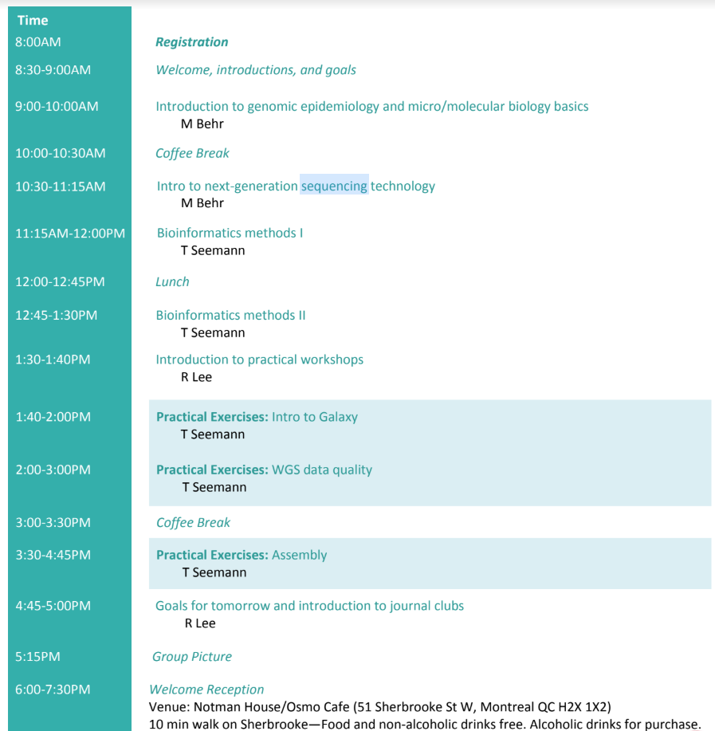

# Day 1

* Slides: [Intro to Genomic Epidemiology](https://www.dropbox.com/sh/kvvkvmhbwzovcg2/AAC66hybLqGAezA8jBIZiI9ba/Monday/MBehr_Lecture1_genomic_epi_overview.pdf) - Marcel
* Slides: [Intro to Next Generation Sequencing](https://www.dropbox.com/sh/kvvkvmhbwzovcg2/AAB8db9qmB39cQ6GTMJxEF8la/Monday/MBehr_Lecture2_nextgen_sequencing.pdf) - Marcel
* Slides: [Bioinformatics methods](https://www.dropbox.com/s/bnqma93ppvzwblb/Bioinformatics%20methods%20-%20McGill%20SI%20-%20T.Seemann.pdf) - Torsten

