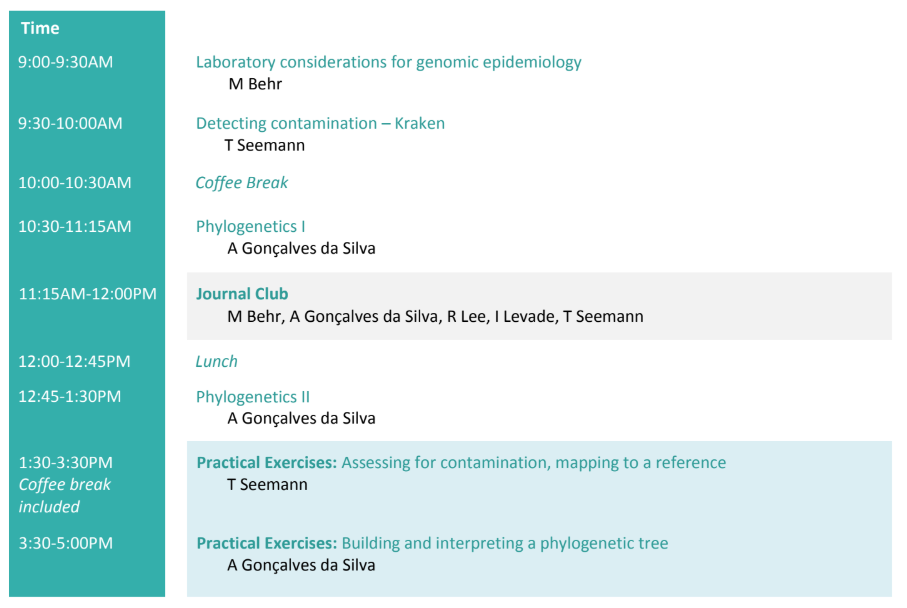

# Agenda Day 2

* Slides: [Lab considerations for Genomic Epidemiology](https://www.dropbox.com/preview/Genomic_epi_2018/Tuesday%2C%20June%2019/MBehr_Lecture1_laboratory_considerations.pdf) - Marcel
* Slides: [Detecting contamination in NGS data](media/misc/not_ready.png) - Torsten
* Slides: [Phylogenetics I](media/misc/not_ready.png) - Anders
* Slides: [Phylogenetics II](media/misc/not_ready.png) - Anders

