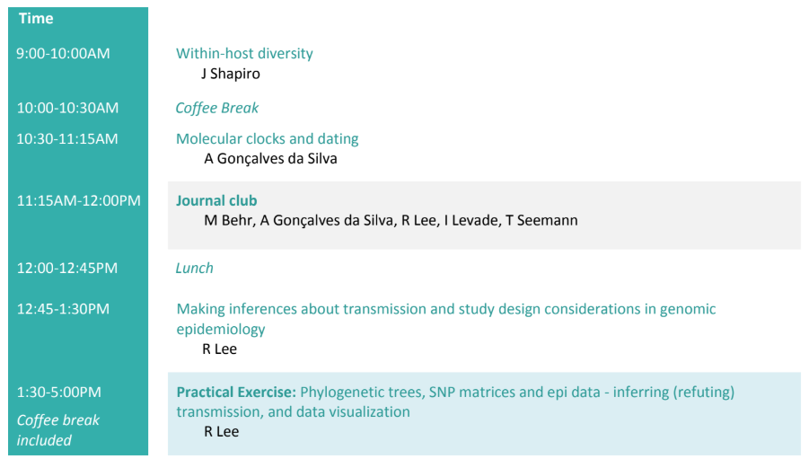

# Agenda Day 3

* Slides: [Within-hist diversity](media/misc/not_ready.png) - Jesse
* Slides: [Molecular clocks and dating](https://www.dropbox.com/s/ksms9841f9uc4sg/Molecular%20dating.pdf?dl=0) - Anders
* Slides: [Inferring transmission in Genomic Epi](https://www.dropbox.com/s/hszpzc2ahe9up1b/Lecture_3_RSLee_Making_inferences_about%20transmission_and_study_design_20180615.pdf) - Robyn

