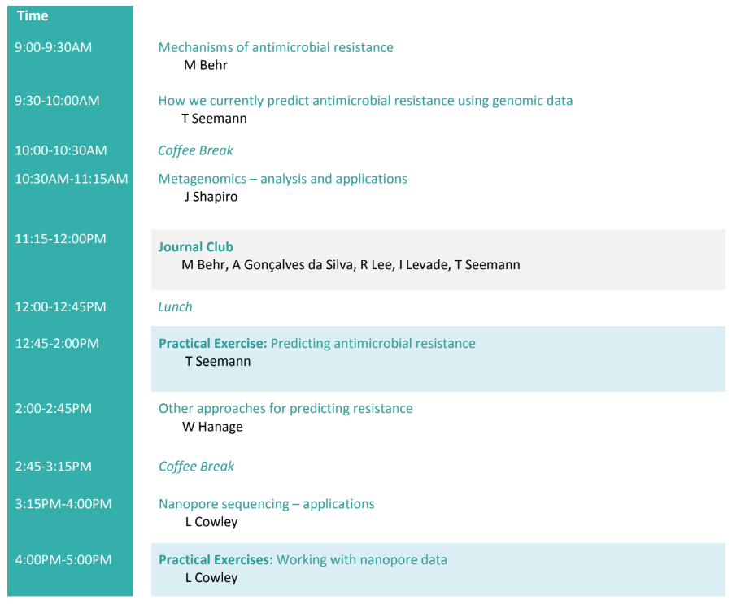

# Agenda Day 4

* Slides: [Mechanisms of antimicrobial resistance](https://www.dropbox.com/preview/Genomic_epi_2018/Thursday%2C%20June%2021/MBehr_Lecture1_mechanisms_of_resistance.pdf) - Marcel
* Slides: [Predicting AMR using genomics data](https://www.dropbox.com/s/ou9lqdv8r5bd38s/Predicting%20AMR%20from%20WGS%20-%20McGill%20SI%20-%20T.Seemann.pdf) - Torsten
* Slides: [Metagenomics - analysis and application](media/misc/not_ready.png) - Jesse
* Slides: [Other approaches for predicting resistance](media/misc/not_ready.png) - Bill
* Slides: [Nanopore sequencing - applications](media/misc/not_ready.png) - Lauren

