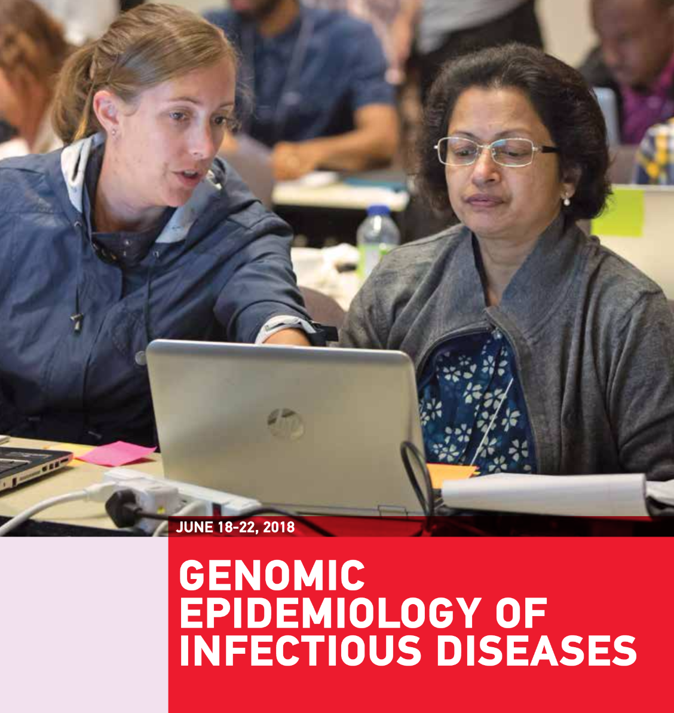

# Welcome!

This site contains tutorials for using the
[Microbial Genomics Virtual Lab](https://www.gvl.org.au/) to perform bioinformatics
tasks on bacterial genome sequence
using the [Galaxy](http://galaxyproject.org/) system.

<!--  -->
