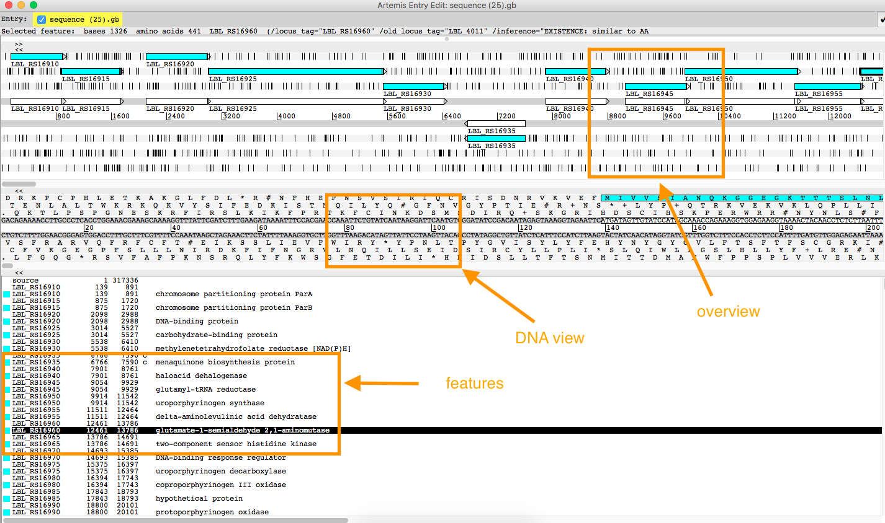

# Introduction to Artemis

## Background

Artemis is a genome browser and annotation tool. Artemis is written in Java and can be used on Mac, Linux or Windows. While it can be used to view any genomic data, it is specifically designed for viewing bacterial or viral genomes. A variety of file types can be loaded and viewed using Artemis; these include FASTA, EMBL, GenBank and GFF3 format files.

## Learning objectives

At the end of this tutorial, you should be able to:

1.  install Artemis on your laptop
2.  download a bacterial genome sequence, and
3.  open the genome sequence in Artemis and look at the sequence features.

## Install Artemis

- Artemis is available at no cost from the Sanger Institute Website.
- Instructions for downloading and installing Artemis can be found at: <http://www.sanger.ac.uk/science/tools/artemis>
- Download and run.
 - Not working? The most common problem: Java is either not installed or too old.
- Artemis needs a recent version of Java v1.6 or higher. Go to <http://java.com> and update.
- Still not working? Seek help!

## Download a bacterial genome

We will download the sequence of *Leptospira borgpetersenii* serovar Hardjobovis Chromosome II from the NCBI website in GenBank format.  

- Go to <http://www.ncbi.nlm.nih.gov>
- Select the “Taxonomy” database from the list on the left hand side.
- Enter “Leptospira borgpetersenii” in the search box and click <ss>Search</ss>.

- Click on the species name:

&nbsp;

- Click on the species name again (at the top of the list):

&nbsp;

- Next to <ss>Genome</ss>, click on the far right number <ss>1</ss>.

<!---FIXME: add arrow to point to it.  
--->

&nbsp;

- Click on <ss>Genome Assembly and Annotation report</ss>:

&nbsp;

&nbsp;

- Then, for the first species listed, scroll to the far right of the table, see chromosome 2, and click the link to the annotated assembly number <ss>NC_008509.1</ss> (not CP0003):

&nbsp;

- Then, click <ss>Send</ss>
- choose <ss>Complete Record</ss>, <ss>Destination &rarr; File</ss>, <ss>Format &rarr; GenBank (full)</ss>
- click <ss>Create File</ss>.
- Note the download location (e.g. Downloads folder).

&nbsp;

## Open the GenBank file in Artemis

- Open Artemis

- <ss>Menu &rarr; File &rarr; Open</ss>
- Select file from dialog box, and <ss>OPEN</ss>

## The Artemis interface

There are three main panes:

1. The overview
2. The DNA view
3. Text summary of features

Overview:  

- 6-frame annotation
- annotated genome features are highlighted
- black lines are stop codons

DNA view:

- 6-frame translation
- DNA sequence in the middle
- amino acid translations above and below

Text summary:

- text summary of features

Navigation:

- Go to the overview pane
- click on one annotated feature (highlighted in blue)
- it will be summarized on the top line ("selected feature")
- the corresponding sequence will be highlighted in the DNA view pane
- the corresponding feature will be higlighted in the text summary pane
- now double click on the same annotated feature
- all three panes will be centred for this feature
- to move left or right, use the horizontal scroll bars under each pane
- to zoom, use the vertical scroll bars on the right

## What next  

- Links to more information: [the Artemis manual.](ftp://ftp.sanger.ac.uk/pub/resources/software/artemis/artemis.pdf)

- [Assemble a bacterial genome using Spades.](../spades/index.md)
