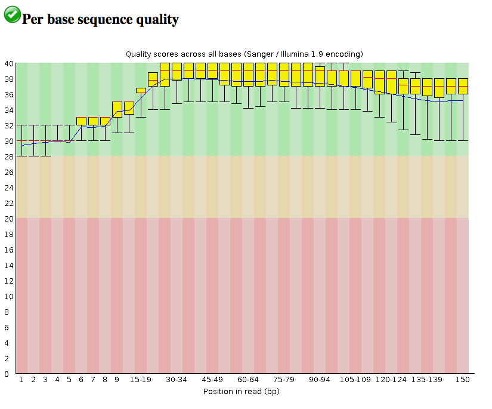
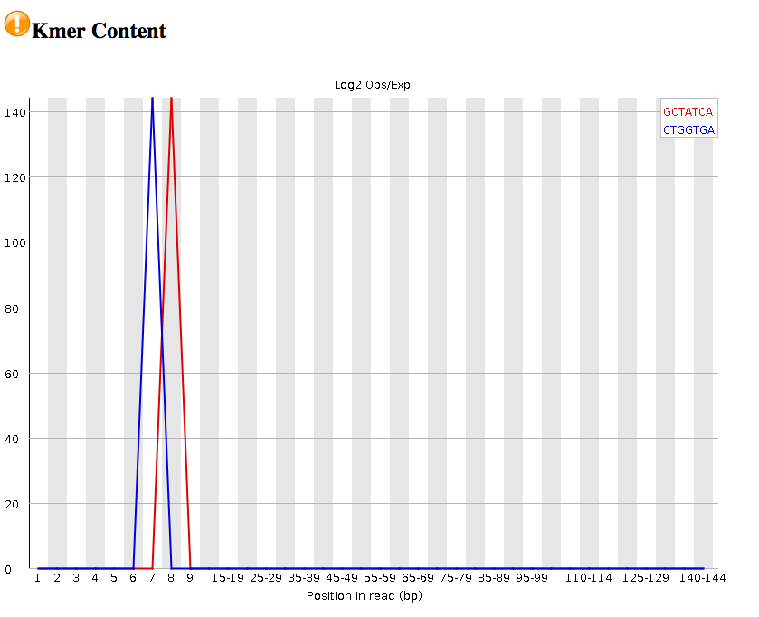

 
# FastQC in Galaxy

<!---
FIXME: include screenshots
FIXME: include file location and/or choose different input.
--->

After sequencing, the reads should be checked for their quality. This tutorial demonstrates how to use the tool called FastQC to examine bacterial paired-end Illumina sequence reads. The FastQC website is [here.](http://www.bioinformatics.babraham.ac.uk/projects/fastqc/)

## Learning Objectives

At the end of this tutorial you should be able to:

1. run FastQC on input sequence reads, and
2. examine the FastQC output.

## Input files

See [here](/modules/data-dna/index.md) for the link to import the "Galaxy history of input files" for this tutorial, if you don't already have them in your history.

- We will use the paired-end read set from our Galaxy history.
- These are the files <fn>mutant_R1.fastq</fn> and <fn>mutant_R2.fastq</fn>.
- FASTQ is a file format for sequence reads that displays quality scores for each of the sequenced nucleotides. For more information about FASTQ format see this [link](https://en.wikipedia.org/wiki/FASTQ_format).
- We will evaluate the <fn>mutant_R1.fastq</fn> reads using the FastQC tool.

## Run FastQC

- Go to <ss>Tools &rarr; NGS Analysis &rarr; NGS: QC and Manipulation &rarr; FastQC</ss>

- for <ss>Short read data from your current history</ss>: <fn>mutant_R1.fastq</fn>
- Click <ss>Execute</ss>
- In the History pane, click on the "refresh" icon to see if the analysis has finished.

## Examine output files
Once finished, examine the output called <fn>FastQC on data1:webpage</fn> (Hint: click the eye icon). It has a summary at the top of the page and a number of graphs.

Look at:

-  <ss>Basic Statistics</ss>

    - <ss>Sequence length</ss>: will be important in setting maximum k-mer size value for assembly.
    - <ss>Encoding</ss>: The quality encoding type is important for quality trimming software.
    - <ss>% GC</ss>: high GC organisms don’t tend to assemble well and may have an uneven read coverage distribution.
    - <ss>Total sequences</ss>: Total number of reads: gives you an idea of coverage.

-  <ss>Per base sequence quality</ss>: Dips in quality near the beginning, middle or end of the reads: determines possible trimming/cleanup methods and parameters and may indicate technical problems with the sequencing process/machine run. In this case, all the reads are of relatively high quality across their length (150 bp).

-   <ss>Per base N content</ss>: Presence of large numbers of Ns in reads may point to a poor quality sequencing run. You would need to trim these reads to remove Ns.

-   <ss>Kmer content</ss>: Presence of highly recurring k-mers: may point to contamination of reads with barcodes, adapter sequences etc. In this case, we have spikes in two types of kmers. <!-- explain why?
-->

We have warnings for two outputs (per base sequence content; Kmer content). This would warrant more investigation.

General questions you might ask about your input reads include:

- How good is my read set?
- Do I need to ask for a new sequencing run?  
- Is it suitable for the analysis I need to do?

For a fuller discussion of FastQC outputs and warnings, see the [FastQC website link](http://www.bioinformatics.babraham.ac.uk/projects/fastqc/), including the section on each of the output [reports](http://www.bioinformatics.babraham.ac.uk/projects/fastqc/Help/3%20Analysis%20Modules/), and examples of ["good"](http://www.bioinformatics.babraham.ac.uk/projects/fastqc/good_sequence_short_fastqc.html) and ["bad"](http://www.bioinformatics.babraham.ac.uk/projects/fastqc/bad_sequence_fastqc.html) Illumina data.

## What Next?
[Assemble the reads into a draft genome sequence](../spades/index.md).

<!--
- Trim reads with [Trimmomatic.](../trimmomatic/index.md)
-->

<!---
FIXME: include these?

- link to a fastqc protocol:
http://vlsci.github.io/lscc_docs/tutorials/assembly/assembly-protocol/#section-1-read-quality-control

- more detailed information:
https://docs.google.com/document/pub?id=16GwPmwYW7o_r-ZUgCu8-oSBBY1gC97TfTTinGDk98Ws
--->
