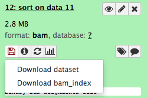

# Comparative Genomics

## Background

In this activity we will identify ‘micro’ differences between genome
sequences using the BWA short read mapper and Freebayes variant caller. After investigating the ‘micro’ differences (SNPs/INDELS), we will attempt to detect larger ‘macro’ differences using Mauve.

## Learning objectives
At the end of this tutorial you should be able to:

1. map sequence reads to a reference genome
2. view the mapped reads
3. identify variants using Freebayes, and
4. identify larger structural variants using Mauve.

## Input data

The genome sequences being compared are those of the ‘wildtype’ and ‘mutant’ strains.

The relevant files should already be available on Galaxy (from the previous "Assembly with Spades" tutorial).

Just for a recap:

We have a closed, annotated genome sequence for the wildtype strain. This file has two formats (one with the sequence, and one with the features).

- Files: <fn>wildtype.fna</fn> and <fn>wildtype.gff</fn>

For the mutant strain we have whole genome shotgun short sequence reads
from an Illumina DNA sequencing instrument.

- Files: <fn>mutant_R1.fastq</fn> and <fn>mutant_R2.fastq</fn> (fastq format)

-   The reads are paired-end
-   Each read is 150 bases  
-   The reads coverage depth is estimated at 19x.

## Map reads to reference

### Map the reads on to the reference sequence

Several programs could be used for this but we will use BWA-MEM.

- Go to <ss>Tools &rarr; NGS Analysis &rarr; NGS: Mapping &rarr; Map with BWA-MEM</ss>.
- Set the following parameters:
- <ss>Will you select a reference genome from your history or use a built-in index?</ss>: *Use a genome from history and build index*
- <ss>Use the following dataset as the reference sequence</ss>: *wildtype.fna*
- <ss>Select first set of reads</ss>:*mutant_R1.fastq*
- <ss>Select second set of reads</ss>:*mutant_R2.fastq*
- Click <ss>Execute</ss>.

### Examine the mapped reads

To do this, we will look at the contents of the BAM file.

!!! hint  
    The BAM file is a Binary Compressed Datafile and cannot be viewed directly. If you attempt to view it using the "view data" button (the eye icon) it will be downloaded to your local computer. Instead, we must convert it to a non-compressed text format (SAM) first.

- Go to <ss>Tools &rarr; NGS Common Toolsets &rarr; NGS: SAM tools &rarr; BAM-to-SAM</ss>.
- <ss>BAM File to Convert</ss>: *your BAM file*
- <ss>Execute</ss>.
- View the resultant SAM file by clicking on the eye icon.
- Have a look at the fields in the file (the column headings).
- The demonstrator will now point out what all the fields are. (FIXME: or add some info here?)

## View the BAM file using Artemis

In this section we will use Artemis to view the BAM file we produced above.

### Download the BAM file to your local computer.

- Click on the name of the BAM file that you created in Section 1.  
- Click on the download button ; you need to download both the BAM file and the bam_index. (FIXME: why?)

- Also, download the annotated reference sequence; <fn>wildtype.gff</fn>.

### Start Artemis and load the wildtype.gff

- From the Artemis menu, Click <ss>File &rarr; Open ...</ss>  
- Load <fn>wildtype.gff</fn>.

You should now have the wildtype’s annotated sequence loaded into the Artemis genome browser.

### Load the BAM file into Artemis

- Click <ss>File &rarr; Read BAM/VCF</ss>  
- <ss>Select</ss>: <fn>Galaxy … .bam</fn>  
- Click <ss>Ok</ss>   

FIXME: but don't load index? bai file?

You should see something like this:

Can you find a SNP?

Demonstration of the ways that the view of the BAM file can be enhanced!

Imagine finding each SNP manually - luckily this can be automated using a tool available on Galaxy.

## Variant Calling

We will now search through our alignment file (BAM) for statistically-valid SNPs using the Freebayes variant calling tool.

### Run Freebayes

- Go to <ss>Tools &rarr; NGS Analysis &rarr; NGS: Variant Analysis &rarr; FreeBayes</ss>
- Set the following parameters:
- <ss>Load reference genome from</ss>: *History*  
- <ss>Sample BAM file</ss>: *Map with BWA-MEM on data … BAM format*
- <ss>Use the following dataset as the reference sequence</ss>: <fn>wildtype.fna</fn>  
- Click <ss>Execute</ss>

### Examine the Freebayes output

- Freebayes will create a VCF file. This stands for Variant Calling Format.
- Click on its View Data button (eye icon) and have a look at the file. There is a lot of header information; the variants appear lower down.
- Can you spot a SNP?
- What about an insertion? A deletion?

## Investigation of Variants

What is the impact of the differences we have observed?

In this section we will use some simple strategies to predict the impact of the variant on the function of the gene and
perhaps even the strain itself.

**Artemis** - the annotated draft genome sequence of the mutant strain -
what is the impact the protein coding region? what is the predicted
function?

**blastp** - <http://blast.ncbi.nlm.nih.gov/Blast.cgi> the protein domain display - are any major protein domains truncated by the difference?

**LipoP/SignalP/TmHMM** - <http://www.cbs.dtu.dk/services/> membrane location prediction - has the change had an impact on the membrane location of the protein?

**Literature?**

Can you suggest a type of nucleotide sequence that might have no impact on the function of the encoded protein?

In this section we will investigate a few variants together as a demonstration

perhaps a few individually too??

## Detection of ‘macro’ INDELS and rearrangement using Mauve

We will now examine our earlier assembly and compare it with the reference on a genome wide basis using Mauve.

Download and install Mauve. More information on Mauve and its use can be found [here](http://darlinglab.org/mauve/mauve.html).

You will then need to load both the reference <fn>wildtype.gff</fn> file and the <fn>mutant.gff</fn> file that you downloaded earlier.

FIXME: add more
