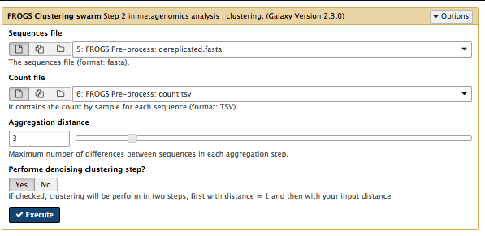
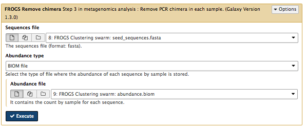
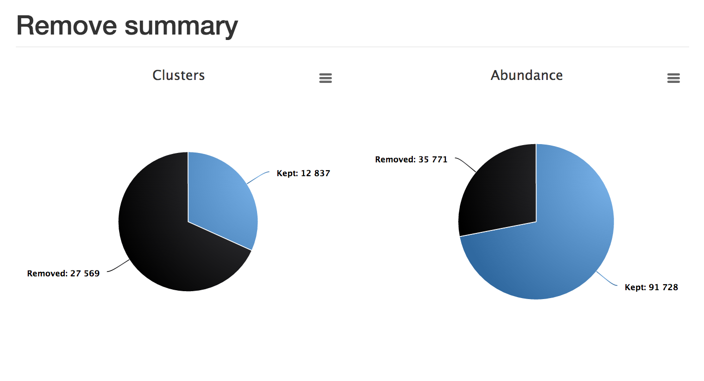
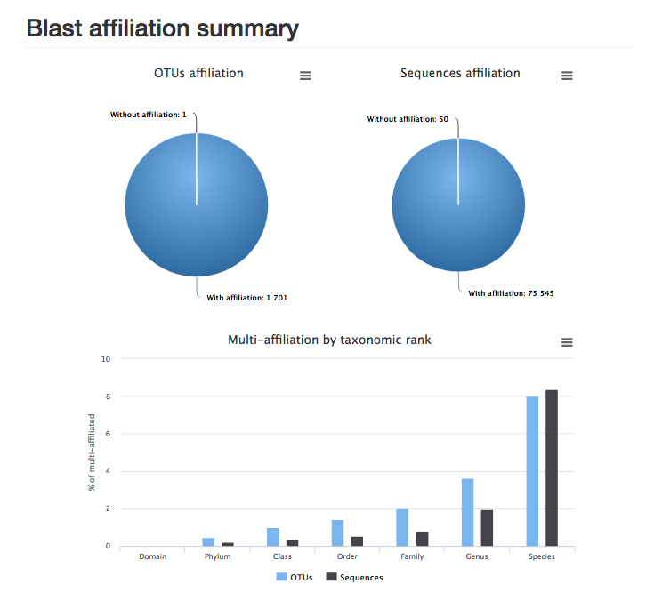
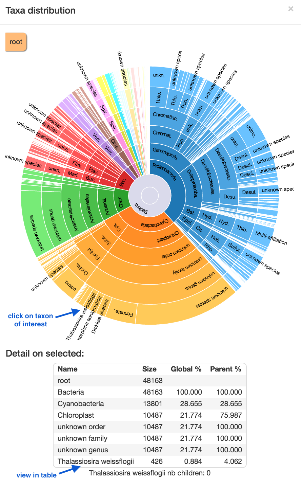
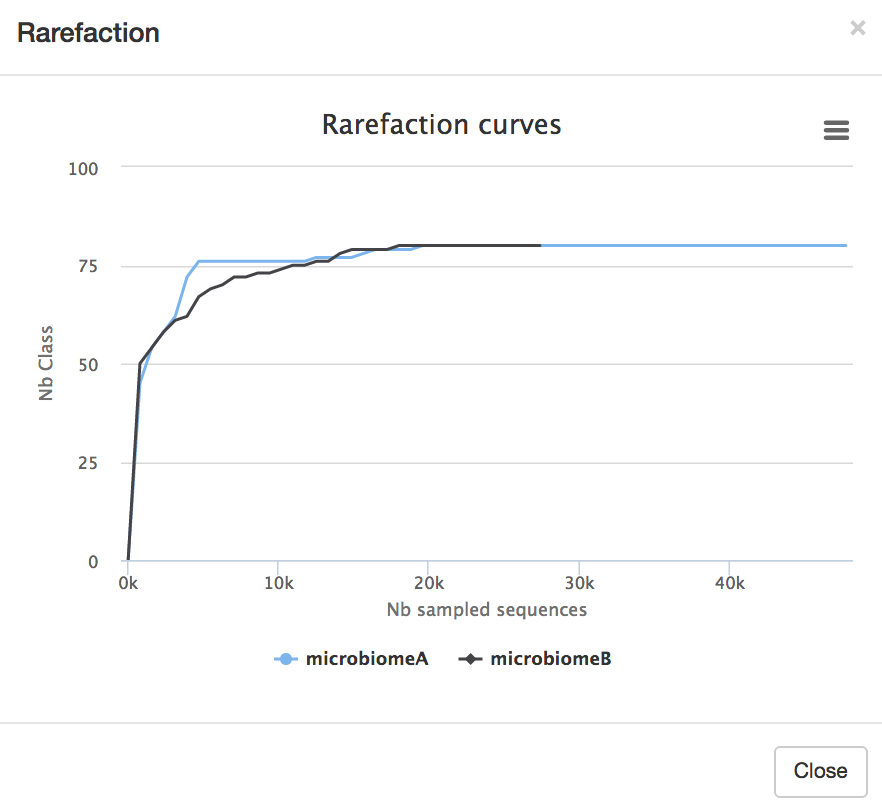

#Metagenomics

Metagenomics aims to compare microbial communities from different environments by using information from the metagenome. Typically, 16S rRNA is used when classifying taxa, and whole-genome sequencing when aiming to identify gene functions and pathways.

<!-- - compare microbial communities from different environments: do this by comparing the metagenome: e.g. GC-content, k-mers, size, how many spp, functions of genes
- eg for function, can compare to a database (COG or KEGG) and see whether metagenomes differ (statistically test) -
- More about 16S rRNA: The 16S sequence is RNA that makes up part of the bacterial ribosome (together with other rRNA and protein). The operon is 16S, 23S, 5S - and there may be many copies of the operon (7 in E coli).
-->

This tutorial covers the tool called FROGS (in Galaxy): "Find Rapidly OTU with Galaxy Solution".
<!-- dental and phln only? -->

<!-- - uses a different way of clustering similar sequences into OTUs. -->

##Get data

- The data: paired-end Illumina reads from two environmental samples. <!-- two env samples? dental microbiomes?-->

- In Galaxy, in the history panel, click on the cog item, and select "import from file".

    - In the "Archived History URL:" box paste:
    - <tt>https://swift.rc.nectar.org.au:8888/v1/AUTH_377/public/Microbial_tutorials/Galaxy-History-16S_metagenomics_dataset.tar.gz</tt>

    - You should now have four files in your Galaxy history.

<!-- - Download the <fn>.tar.gz</fn> file to your local computer using this link: <https://drive.google.com/open?id=0B-DKulJTTftlT2djQmJ4aTN6Q1U>.
- Click on the file to unzip it into four <fn>.gz</fn> files. These can stay zipped.
- In Galaxy, go to <ss>Get Data: Upload File</ss>. Choose the the four files, set their file type to "fastqsanger", click start, then close.
- The four files should now be in your current history.
-->

<!-- I have renamed these files as microbiomeA_R1 and microbiomeB_R1 etc -->

- In the Galaxy tools panel, in the top search bar, type FROGS.
    - This will bring up the various tools available.
    - We will be using 6 of these tools.

##1. Pre-process

This is the first step in the Frogs analysis. It takes in the forward and reverse sequencing reads (R1 and R2) from multiple samples (e.g. microbiome A and microbiome B) and performs the following steps:

- If the data is not in contigs, read1 and read2 will be overlapped (allowing some mismatch in overlapping region).
- Contigs that are too big or too small will be filtered out. <!-- what's wrong with too big?-->
- If using the Illumina standard protocol: will look for those primers, filter out contigs without primers, and cut the primer sequences.
- Sequences that are too small or of poor quality will be filtered out.
- Sequences will be de-replicated: duplicates will be removed but the number of duplicates will be recorded.

### Run

Go to <ss>FROGS Pre-process</ss> and select the following:

- <ss>Sequencer</ss>: Illumina
- <ss>Input type</ss>: Files by samples
- <ss>Reads alread contiged?</ss>: No
- <ss>Samples</ss>:
    - <ss>Name</ss>: microbiomeA <*note: no spaces*>
    - <ss>Reads1</ss>: <fn>microbiomeA_R1.fq</fn>
    - <ss>Reads2</ss>: <fn>microbiomeA_R2.fq</fn>
    - <ss>Insert Samples</ss>- click plus sign
    - <ss>Name</ss>: microbiomeB
    - <ss>Reads1</ss>: <fn>microbiomeB_R1.fq</fn>
    - <ss>Reads2</ss>: <fn>microbiomeB_R2.fq</fn>
- <ss>Reads 1 size</ss>: 250
- <ss>Reads 2 size</ss>: 250
- <ss>Expected amplicon size</ss>: 420
- <ss>Minimum amplicon size</ss>: 380
- <ss>Maximum amplicon size</ss>: 460
- <ss>Sequencing protocol</ss>: Illumina standard
- <ss>5' primer</ss>: GGCGVACGGGTGAGTAA
- <ss>3' primer</ss>: GTGCCAGCNGCNGCGG <*note: needs to be in 5' to 3' orientation*>
- <ss>Execute</ss>

### Output

There are three output files. Click on the eye icon for each to see their contents.

Report:

- The <fn>report.html</fn> shows how samples were filtered. For example, in the bar chart called "Filtering summary", the number of reads kept at each filtering stage is displayed. We would expect some decrease in some of these categories, but if many reads have been filtered at a particular stage it could indicate poor quality data.

- Below this chart, a table shows the statistics for each sample. Check the boxes next to "microbiomeA" and "microbiomeB" and then click <ss>Display amplicon lengths</ss> - shows amplicon distribution before filtering. Click <ss>Display preprocessed amplicon lengths</ss> - shows the distribution has been narrowed after filtering. Check if both samples are similar.

Counts:

- The <fn>counts.tsv</fn> file is a list of sequences and their counts in the two samples.

Fasta file:

- The <fn>dereplicated.fasta</fn> contains the sequences, without any duplicates.

##2. Clustering swarm

In this step, sequences are clustered into groups using Swarm (more information about [Swarm](https://peerj.com/articles/593/)). This takes the pre-processed <fn>fasta</fn> and <fn>counts</fn> files and does the following:

- Sorts reads by abundance.
- Clusters the reads into pre-clusters using Swarm and distance parameter of 1.
- Sorts these pre-clusters by abundance.
- Cluster the pre-clusters using Swarm and a user-specified distance.

Go to <ss>FROGS Clustering swarm</ss> and select the following:

- <ss>Sequences files</ss>: <fn>dereplicated.fasta</fn>
- <ss>Counts file</ss>: <fn>count.tsv</fn>
- <ss>Aggregation distance</ss>: 3
- <ss>Perform deionising clustering step?</ss>: Yes
- <ss>Execute</ss>

*Note: Galaxy may say that the job submission has failed. Click Close, then click refresh in the top of the history panel. The job should be running.*

### Output

There are three output files.

- The <fn>abundance.biom</fn> shows the abundance of each cluster.
- The <fn>seed_sequences.fasta</fn> contains the the cluster (OTU) representative sequences. <!-- the seqs used to start clustering? not the final clusterss? -->
- The <fn>swarms.composition.tsv</fn> shows what is in each cluster.

##3. Remove chimera

Closely-related sequences may form chimeras (mixed sequences) during PCR (libray prep). This step removes these sequences by the following method:

- Splits input data into samples
- Uses vsearch to find chimeras in each sample
- Removes chimeras

Go to <ss>FROGS Remove chimera</ss> and select the following:

- <ss>Sequences file</ss>: <fn>seed_sequences.fasta</fn>
- <ss>Abundance type</ss>: <fn>BIOM file</fn>
- <ss>Abundance file</ss>: <fn>abundance.biom</fn>
- <ss>Execute</ss>

*Note: Galaxy may say that the job submission has failed. Click Close, then click refresh in the top of the history panel. The job should be running.*

### Output

There are three output files.

- The <fn>non_chimera.fasta</fn> is a filtered file containing no chimeras.
- The <fn>non_chimera_abundance.biom</fn> is a filtered abundance file containing no chimeras.
- The summary <fn>report.html</fn>. In this case, although almost 70% of the clusters were removed, more than 70% of the actual reads were kept.

##4. Filters

The OTUs (Operational Taxonomic Units) have now been clustered. In this step, we will filter out some of the OTUs that are either not in both samples, and/or contain at least 0.005% of all the sequences.

Go to <ss>FROGS Filters</ss> and select the following:

- <ss>Sequences file</ss>: <fn>non_chimera.fasta</fn>
- <ss>Abundance file</ss>:  <fn>non_chimera_abundance.biom</fn>
- <ss>*** THE FILTERS ON OTUS IN SAMPLES, OTUS SIZE and SEQUENCE PERCENTAGE</ss>: Apply filters
- <ss>Minimum number of samples</ss>: 2
- <ss>Minimum proportion/number of sequences to keep OTU</ss>: 0.00005
- <ss>N biggest OTU</ss>: leave blank
- <ss>*** THE FILTERS ON RDP</ss>: No filters
- <ss>*** THE FILTERS ON BLAST</ss>: No filters
- <ss>*** THE FILTERS ON CONTAMINATIONS</ss>: No filters
- <ss>Execute</ss>

]

*Note: Galaxy may say that the job submission has failed. Click Close, then click refresh in the top of the history panel. The job should be running.*

### Output

There are four output files.

- <fn>sequences.fasta</fn>: the retained sequences.
- <fn>abudance.biom</fn>: the abundance file.
- <fn>excluded.tsv</fn>: discarded OTUs
- <fn>report.html</fn>: this shows the proportion of OTUs and the proportion of sequences kept. In this example, although most OTUs have been filtered out, most sequences have been retained.

<!-- We should do 3+ samples
Then could click on Venn diagram here and see intersection.
-->

##5. Affiliation OTU

An OTU is a cluster of sequences. This step adds the taxonomy to the abundance file. It uses the SILVA database for rRNA.<!--add more info about Silva-->

<!-- - that has been filtered for only (16S or all 30S?), non-redundant, keeping certain taxonomic levels, and split into pro and eukaryotes.

blastn+ to align each OTU against seqs in the dbase, keeping the best.
- It can return multi-affiliation - see notes below tool panel.

-->

Go to <ss>FROGS Affiliation OTU</ss> and select:

- <ss>Using reference database</ss>: silva123
- <ss>Also perform RDP assignation</ss>: No
- <ss>OTU seed sequence</ss>: <fn>sequences.fasta</fn> from step 4
- <ss>Abundance file</ss>: <fn>abundance.biom</fn> from step 4
- <ss>Execute</ss>

*Note: Galaxy may say that the job submission has failed. Click Close, then click refresh in the top of the history panel. The job should be running.*

<!-- can take 10 mins or so? -->

### Output

There are two output files.

- <fn>affiliation.biom</fn>: the abundance file with affiliation. Note: this <fn>.biom</fn> file is not human-readable. If you wish, you can convert it with the FROGS **biom to tsv** tool.

- <fn>report.html</fn>: the report shows the proportion of OTUs and sequences affiliated to sequences in the database. Here we can see that almost all OTUs and sequences have been taxonomically assigned, but almost 10% of OTUs could be assigned to multiple species. <!--is that interpreation correct?-->

##6. Affiliations stat

This step computes some statistics from the analysis and generates a report of the OTUs/taxonomy found.

Go to <ss>FROGS Affiliations stat</ss> and select:

- <ss>Abundance file</ss>: <fn>affiliation.biom</fn> from step 5
- <ss>Rarefaction ranks</ss>: Class Order Family Genus Species
- <ss>Affiliation processed</ss>: FROGS blast
- <ss>Execute</ss>

### Output

There is one output file. Click on the eye icon next to <fn>summary.html</fn>:

- click on <ss>Display global distribution</ss>: this shows the taxonomy of the sample. Start at the centre; major groups each have a segment by colour; as you go outwards, taxonomic identification becomes more specific. <!-- this is the pooled info from both samples? --> Click on a segment to display a table of statisics below. Click on the cross in the top right corner to exit.

<!--is there a way to summarize this info across samples? eg sample 1 had lots of taxon A compared to sample 2 etc... or this taxon found only in sample B etc... (although I think these ones were filtered out)? -->

- Next, we will look at the rarefaction curve, which is a measure of samples vs diversity. <!-- is that correct? In other words, how many samples do we have to take before we are covering the taxonomic diversity?--> Click on the boxes next to each of the samples (both, or one at a time) in the table (microbiomeA and microbiomeB). Click <ss>Display rarefaction</ss>.

##Links
- FROGS slides by Yvan Le Bras <https://f1000research.com/slides/5-1832>
- The SILVA database: <https://www.arb-silva.de/>
- Other metagenomics software:
    - QIIME: <http://qiime.org/>    
    - UPARSE: <http://www.drive5.com/uparse/>
    - MOTHUR: <https://www.mothur.org/>
    - MG-RAST: <http://metagenomics.anl.gov/>
