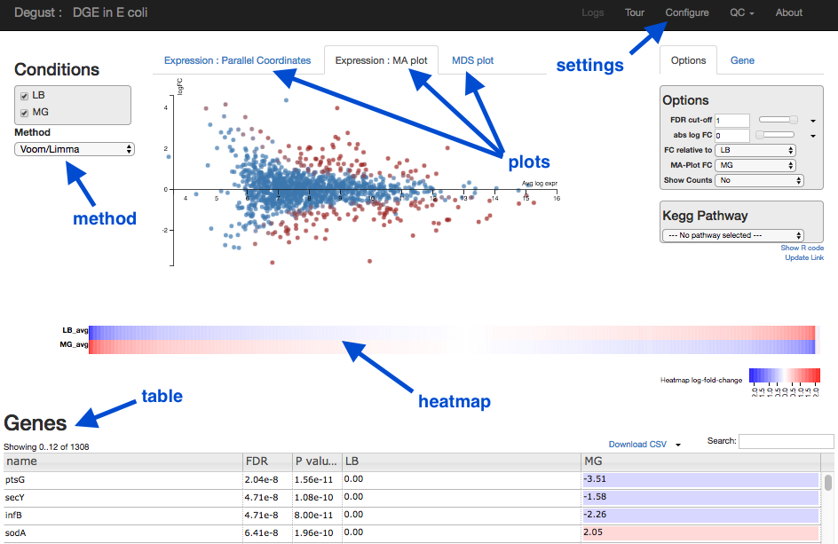
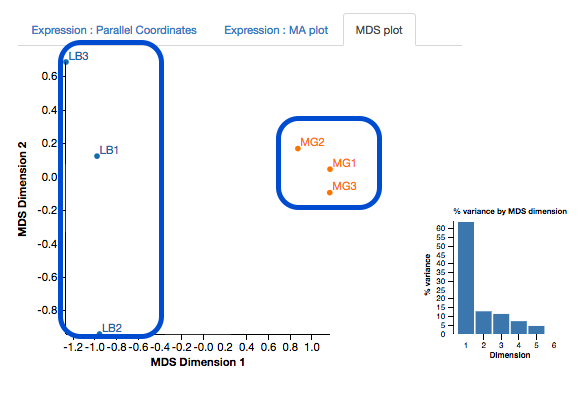
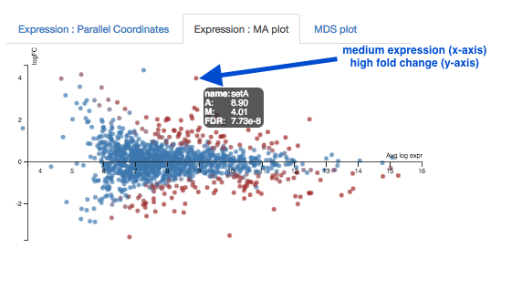
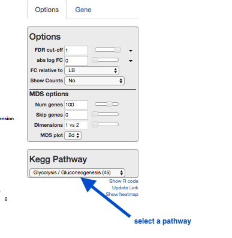

# DGE using kallisto

This tutorial is about differential gene expression in bacteria, using tools on the command-line tools (kallisto) and the web (Degust).

## Background
Differential Gene Expression (DGE) is the process of determining whether any genes were expressed at a different level between two conditions. For example, the conditions could be wildtype versus mutant, or the same sample from two growth conditions. Usually multiple biological replicates are done for each condition - these are needed to separate variation within the condition from that between the conditions.

There are several ways to test for DGE. All involve these steps:

* map/align reads to transcripts
* count number of reads per transcript
* see if counts differ between conditions

Some tools will combine two of these steps. For example, options include:

* Map reads to reference genome with BWA-MEM, count reads per transcript with HTSeq-count, examine DGE using voom/limma (within Galaxy or Degust).

* Pseudo-align reads to a reference transcriptome and count, using kallisto, then examine DGE using voom/limma (within Galaxy or Degust).

<!-- Alternatives: with R-subread, or salmon, or BWA+htfc --->

## Learning Objectives

At the end of this tutorial you should be able to:

1. (Pseudo-)align RNA-Seq data to a reference transcriptome and count: kallisto  
2. Perform statistical analysis to obtain a list of differentially expressed genes: Degust
3. Visualize and interpret the results


## RNA-Seq reads

A typical experiment will have 2 conditions each with 3 replicates, for a total of 6 samples.

- Our RNA-seq reads are from 6 samples in <fn>FASTQ</fn> format.
    - We have single-end reads; so one file per sample.
    - Data could also be paired-end reads, and there would be two files per sample.
- These have been reduced to 1% of their original size for this tutorial.
- The experiment used the bacteria *E. coli* grown in two conditions.
    - Files labelled "LB" are the wildtype
    - Files labelled "MG" have been exposed to 0.5% &alpha;MG - alpha methyglucoside (a sugar solution).


The files are from [Study PRJNA194149 from EBI ENA](http://www.ebi.ac.uk/ena/data/view/PRJNA194149). We are using 3 FASTQ files from the control set (SRR794833-835) and 3 FASTQ files from the experimental condition set (SRR794848-850).

## Get data

Login to your GVL. *e.g.*:

```
ssh your_username@gvl.genome.edu.au
<enter your password>
```


Get the files:

```bash
wget https://swift.rc.nectar.org.au:8888/v1/AUTH_377/public/Microbial_tutorials/Ecoli_kallisto_files.tar.gz
```

Uncompress and extract the files:

```
tar -zxvf Ecoli_kallisto_files.tar.gz
```

Move into the new directory:

```
cd Ecoli_kallisto_files
```

You should have the following files:

- 6 x RNA-seq reads in <fn>fastq.gz</fn>
- 1 x reference transcriptome in <fn>.fasta</fn>
- 1 x table of features in <fn>.tsv</fn>

The reference transcriptome and features table have been produced from a genbank file, using a custom [python script](https://github.com/AnnaSyme/genbank_to_kallisto.py).

We need to count the number of RNA-seq reads (that exist as fragments) that match different transcripts in the genome, including those for protein-coding sequences (such as genes) and RNA sequences (such as tRNA and mRNA). Therefore, we need a subset of the whole genome - the reference transcriptome.  

<!-- Need biopython on ABRPI for this to work

Download the E. coli genbank file:
```
wget https://swift.rc.nectar.org.au:8888/v1/AUTH_377/public/Microbial_tutorials/Ecoli_reference_NC_000913.gbk
```

Download the custom python script:
```
wget https://raw.githubusercontent.com/AnnaSyme/genbank_to_kallisto.py/master/genbank_to_kallisto.py
```

Generate the reference transcriptome: We will use the custom python script called "genbank_to_kallisto.py". You also need to enter the name of an <fn>input genbank file</fn>, and the names for two output files that will be generated: a <fn>transcripts.fasta</fn> file and a <fn>table.tsv</fn> file. We type in "python3" at the start to run this script using python.

```python
python3 genbank_to_kallisto.py Ecoli.gbk Ecoli_transcripts.fasta Ecoli_table.tsv
```

Give table.tsv headers:

first remove CRLF (the M symbols) in the file:
(to type in the symbol, press ctrl-v ctrl-m)

tr -d "^M" < Ecoli_table.tsv > Ecoli_table2.tsv

then add header line

```
echo -e "ID\tfeature\tname\tEC\tdesc" | cat - Ecoli_table2.tsv > Ecoli_features.tsv
```

--->

## Generate counts

Kallisto will count the reads per transcript.

### Index the transcripts file

``` bash
kallisto index -i transcripts.idx Ecoli_transcripts.fasta
```

- <fn>transcripts.idx</fn>: the name of the output index file
- <fn>transcripts.ffn</fn>: the name of the input fasta file file

### Run kallisto for every read set

First, run kallisto for the <fn>LB1.fastq.gz</fn> reads:

```bash
kallisto quant -i transcripts.idx -o LB1 --single -l 500 -s 50 LB1.fastq.gz
```

- -o LB1: LB1 will be name of the output folder produced from this analysis
- --single : single-end reads
- -l : estimated length of library fragments <!-- fragments? -->
- -s : estimated standard deviation of library fragments
- <fn>LB1.fastq.gz</fn> : input FASTQ file

Repeat for every FASTQ file (LB2, LB3, MG1, MG2, MG3).

- Run as above, but change the name of the output folder, and the file name at the end.
- We then need to combine all the counts into one table.

### Extract required columns

Each output folder includes an <fn>abundance.tsv</fn> file. For each of these files, extract the column of counts (column 4) and remove the table heading.

```bash
cut -f4 -d$'\t' abundance.tsv | tail -n +2 > LB1_headless.tsv
```
This cuts column 4, then removes the header, and saves as <fn>LB1_headless.tsv</fn>.

Then add column heading "LB1" and saves as <fn>LB1.tsv</fn>:

```bash
echo -e "LB1" | cat - LB1_headless.tsv > LB1.tsv
```

Move <fn>LB1.tsv</fn> into the main analysis folder.

Repeat with all the other <fn>abundance.tsv</fn> files from the kallisto analyses, giving the tables the correct LBx or MGx header.


### Paste together with features table

```bash
paste LB1.tsv LB2.tsv LB3.tsv MG1.tsv MG2.tsv MG3.tsv Ecoli_features.tsv > counts.tsv
```

Examine the file:

```
less counts.tsv
```

There should be a column for every set of RNA-Seq reads, and then several columns of information including feature, name and description.

Download the <fn>counts.tsv</fn> file to your local computer.

## Test for DGE

Degust is a tool on the web that can analyse the counts files produced in the step above, to test for differential gene expression.

(Degust can also display the results from DGE analyses performed elsewhere.)

###Upload counts file

Go to the [Degust web page](http://degust.erc.monash.edu/). Click <ss>Get Started</ss>.


- Click on <ss>Choose File</ss>.
- Select the <fn>counts.tsv</fn> and click <ss>Open</ss>.
- Click <ss>Upload</ss>.

A Configuation page will appear.

- For <ss>Name</ss> type *DGE in E coli*
- For <ss>Info columns</ss> select *name*  
- For <ss>EC Number column</ss> select *EC*
- For <ss>Analyze server side</ss> leave box checked.
- For <ss>Min read count</ss> put *10*
- Click <ss>Add condition</ss>
    - Under <ss> Replicates</ss>, select LB1, LB2, LB3.
- Click <ss>Add condition</ss> again
    - Under <ss> Replicates</ss>, select MG1, MG2, MG3.
- <ss>Save changes</ss>  
- <ss>View</ss> - this brings up the Degust viewing window.

### Overview of Degust sections

- Top black panel with <ss>Configure</ss> settings at right.
- Left: Conditions: LB (control) and MG (treatment).
- Left: Method selection for DGE.
- Top centre: Plots, with options at right.
- When either of the expression plots are selected, a heatmap appears below.
- A table of genes (or features); expression in treatment relative to control (Treatment column); and significance (FDR column).  



### Analyze gene expression

- Under <ss>Method</ss>, make sure that <ss>Voom/Limma</ss> is selected.
- Click <ss>Apply</ss>. This runs Voom/Limma on the uploaded counts.

### MDS plot

First, look at the MDS plot.



- This is a multidimensional scaling plot which represents the variation between samples.
- Ideally:
    - All the LB samples would be close to each other
    - All the MG samples would be close to each other
    - The LB and MG groups would be far apart
- The x-axis is the dimension with the highest magnitude. The control/treatment samples should be split along this axis.
- Our LB samples are on the left and the MG samples are on the right, which means they are well separated on their major MDS dimension, which looks correct.

### Expression - MA plot
Each dot shows the change in expression in one gene.

- The average expression (over both condition and treatment samples) is represented on the x-axis.
    - Plot points should be symmetrical around the x-axis.
    - We can see that many genes are expressed at a low level, and some are highly expressed.
- The fold change is represented on the y axis.
    - If expression is significantly different between treatment and control, the dots are red. If not, they are blue. (In Degust, significant means FDR <0.05).
    - At low levels of gene expression (low values of the x axis), fold changes are less likely to be significant.

Click on the dot to see the gene name.     



### Expression - Parallel Coordinates and heatmap
Each line shows the change in expression in one gene, between control and treatment.

- Go to <ss>Options</ss> at the right.
    - For <ss>FDR cut-off</ss> set at 0.001.
    - This is a significance level (an adjusted p value). We will set it quite low in this example, to ensure we only examine key differences.
- Look at the Parallel Coordinates plot. There are two axes:
    - Left: **LB**: Gene expression in the control samples. All values are set at zero.
    - Right: **MG** Gene expression in the treatment samples, relative to expression in the control.

- The blocks of blue and red underneath the plot are called a heatmap.
    - Each block is a gene. Click on a block to see its line in the plot above.
    - Look at the row for the Treatment. Relative to the control, genes expressed more are red; genes expressed less are blue.


Note:

- for an experiment with multiple treatments, the various treatment axes can be dragged to rearrange. There is no natural order (such as a time series).

### Table of genes
- **name**: names of genes. Note that gene names are sometimes specific to a species, or they may be only named as a locus ID (a chromosomal location specified in the genome annotation).
- **FDR**: False Discovery Rate. This is an adjusted p value to show the significance of the difference in gene expression between two conditions. Click on column headings to sort. By default, this table is sorted by FDR.
- **LB** and **MG**: log2(Fold Change) of gene expression. The default display is of fold change in the treatment (MG) relative to the control (LB). Therefore, values in the "LB" column are zero. This can be changed in the <ss>Options</ss> panel at the top right.
- In some cases, a large fold change will be meaningful but in others, even a small fold change can be important biologically.

### Kegg Pathway

A pathway is a drawn network to show the interaction between molecules, including some or all of genes, proteins, RNAs, chemical reactions.

- Click on Kegg Pathway, and select "Glycolysis".



- Genes in this pathway will be highlighted as you hover over them elsewhere in Degust (e.g., in the table).

##What next?

To learn more about the differentially-expressed genes:

- Go to [the NCBI website.](http://www.ncbi.nlm.nih.gov)
- Under <ss>All Databases</ss>, click on *Gene*
- Enter the gene name in the search bar; e.g. ptsG
- Click on the first result that matches the species (e.g. in this case, *E. coli*).
    - This provides information about the gene, and may also show further references (e.g. in this case, a link to the EcoGene resource).

Next steps: Investigate the biochemical pathways involving the genes of interest.

## Links

- [Kallisto paper](http://www.nature.com.ezp.lib.unimelb.edu.au/nbt/journal/v34/n5/full/nbt.3519.html)

- [Kallisto + sleuth paper](http://biorxiv.org/content/biorxiv/early/2016/06/10/058164.full.pdf). Sleuth can test for differential gene expression.

- [Link to Voom paper](https://genomebiology.biomedcentral.com/articles/10.1186/gb-2014-15-2-r29)
