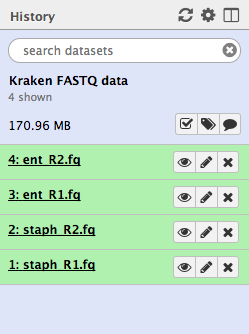
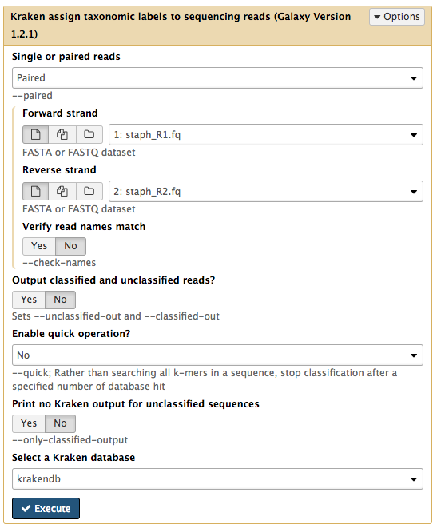
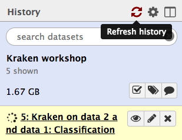
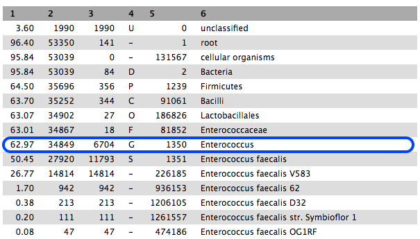
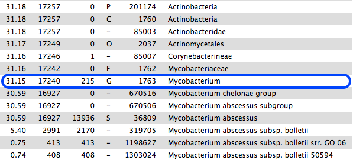

# Sample identification with Kraken

To identify a sample from sequencing reads, we can use the tool "Kraken". This tool can also be used to identify members in a mixed set of reads, for metagenomics.

- e.g. reads from one sample &rarr; Kraken &rarr; 95% *Staphylococcus aureus*.

- e.g. mixed reads &rarr; Kraken &rarr; 50% *Staphylococcus aureus*, 40%  *Campylobacter concisus*, 10% unclassified.

<!-- - is this a proportion of reads?
- is proportion of reads a proxy for relative abundance?
(e.g. something might not sequence well - be truly abundant but rare in the sample) -->

In this tutorial we will use Kraken to confirm the identify of reads from a bacterial isolate.

## Get data

In Galaxy, go to <ss>Shared Data</ss> in the top panel.

* Click on <ss>Data Libraries</ss>
* Click on <fn>Kraken data</fn>
* Tick the box next to each of these files
* Click the <ss>to History</ss> button
* Under <ss>create new</ss> type *Kraken*
* Click <ss>Import</ss>

* Your current history should now contain four files.

## Run Kraken

We have a sample that should be *Staphylococcus aureus*. The paired-end FASTQ read files are:

- <fn>staph_R1.fq</fn> and <fn>staph_R2.fq</fn>.

(We will look at the other set of files later on in the tutorial).

- Go to <ss>Tools &rarr; NGS Analysis &rarr; Metagenomic analyses &rarr; Kraken, assign taxonomic labels to sequencing reads</ss>

- Set the following parameters:

    - <ss>Single or paired reads</ss>: *Paired*
    - <ss>Forward strand:</ss> <fn>staph_R1.fq</fn>
    - <ss>Reverse strand:</ss> <fn>staph_R2.fq</fn>
    - <ss>Select a Kraken database</ss>: choose <fn>minikraken_20171013_4GB</fn>
    - leave other settings as they are
    -  Click <ss>Execute</ss>

<!--- Your tool interface should look like this:

 -->

<!-- ### How it works

Generally: compare sequence to database of known sequence identities.

In detail:

- uses k-mers (default k = 31)
- user to specify a library of genomes
- query database for each k-mer in a sequence
- summarize the hits for all the k-mers from a seq to give the ID
- if seq has no kmers in dbase, it is left unclassified.
-->

## Examine the output

The output is a file called <fn>Kraken on data x and x: Classification</fn>. This will be at the top of your history pane.

Click <ss>Refresh</ss> if the file hasn't yet turned green.

When the file is green, click on the eye icon to view.

- We will turn this output into something easier to read in the next step.
- Column 2 is the sequence ID.
- Column 3 is the taxon ID (from NCBI).
- Column 5 is a summary of all the taxon IDs that each k-mer in the sequence matched to (taxon ID:number of k-mers).  
- Your file may look a little different to this example image.

<!-- Output Format

Each sequence classified by Kraken results in a single line of output. Output lines contain five tab-delimited fields; from left to right, they are:

1. "C"/"U": one letter code indicating that the sequence was either classified or unclassified.
2. The sequence ID, obtained from the FASTA/FASTQ header.
3. The taxonomy ID Kraken used to label the sequence; this is 0 if the sequence is unclassified.
4. The length of the sequence in bp.
5. A space-delimited list indicating the LCA mapping of each k-mer in the sequence. For example, "562:13 561:4 A:31 0:1 562:3" would indicate that:
        a) the first 13 k-mers mapped to taxonomy ID #562
        b) the next 4 k-mers mapped to taxonomy ID #561
        c) the next 31 k-mers contained an ambiguous nucleotide
        d) the next k-mer was not in the database
        e) the last 3 k-mers mapped to taxonomy ID #562
-->

## Kraken report

Go to <ss>Tools &rarr; NGS Analysis &rarr; Metagenomic analyses &rarr; Kraken-report</ss>

- Set the following parameters:

    - <ss>Kraken output</ss>: <fn>Kraken on data x and x: Classification</fn>
    - <ss>Select a Kraken database</ss>: choose <fn>minikraken_20171013_4GB</fn>
    -  Click <ss>Execute</ss>

The output file is called <fn>Kraken-report on data x</fn>.

- Click on the eye icon to view.
- Column 1: percentage of reads in the clade/taxon in Column 6
- Column 2: number of reads in the clade.
- Column 3: number of reads in the clade but not further classified.
- Column 4: code indicating the rank of the classification: (U)nclassified, (D)omain, (K)ingdom, (P)hylum, (C)lass, (O)rder, (F)amily, (G)enus, (S)pecies).
- Column 5: NCBI taxonomy ID.

Approximately 88% of reads were classified as *Staphylococcus aureus*, confirming the correct identity of our bacterial sample.

<!--
- Of these reads, roughly half were uniquely present in *S. aureus* subsp. *aureus*, and most of those were uniquely present in strain HO 5096 0412.
- The sample strain is therefore most related to the HO 5096 0412 strain. -->

The remaining reads within the *S. aureus* clade were classified into various taxa.

- Scroll down column 3 to see the number of reads assigned directly to the taxon in column 6.
- These are all very low and can be disregarded.

<!-- Output

The output of kraken-report is tab-delimited, with one line per taxon. The fields of the output, from left-to-right, are as follows:

1. Percentage of reads covered by the clade rooted at this taxon
2. Number of reads covered by the clade rooted at this taxon
3. Number of reads assigned directly to this taxon
4. A rank code, indicating (U)nclassified, (D)omain, (K)ingdom, (P)hylum, (C)lass, (O)rder, (F)amily, (G)enus, or (S)pecies. All other ranks are simply filled with a dash.
5. NCBI taxonomy ID
6. Indented scientific name -->

## Next

Re-run Kraken with another sample. This sample should be *Enterococcus faecalis*.

- Use the files <fn>ent_R1.fq</fn> and <fn>ent_R2.fq</fn>.
- Run <ss>Kraken</ss> with these files. These are paired-end reads.
- With the <fn>Classification</fn> file from Kraken, run <ss>Kraken-report</ss>.
- Cick on the eye icon to view the <fn>Kraken-report</fn> file.

<!-- What results do you have?

* What taxon are most reads classfied to?
* If you scroll down, are there many reads that are classified to a different taxon?
* What could this mean?
-->

- 63% are classified to the genus *Enterococcus*, and most of these to *E. faecalis*.

- (Our results are probably slightly different to the example image.)

- However, if we scroll down the table of results, we see that 31% are classified to the genus *Mycobacterium*, mostly *M. abscessus*. These are not in the same phylum as *Enterococcus*.

- This sample is probably contaminated.

## Links

[Kraken paper](https://genomebiology.biomedcentral.com/articles/10.1186/gb-2014-15-3-r46)

[Kraken software](http://ccb.jhu.edu/software/kraken/)
