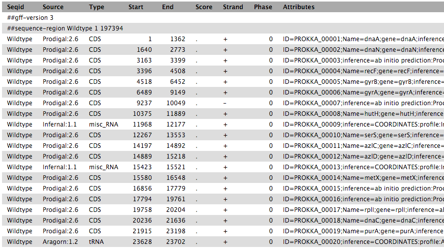
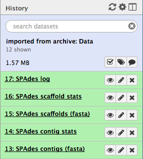

 
# Assembly using Spades

Keywords: de novo assembly, Spades, Galaxy, Microbial Genomics Virtual Lab

## Background
Spades is one of a number of *de novo* assemblers that use short read sets as input (e.g. Illumina Reads), and the assembly method is based on de Bruijn graphs. For information about Spades see this [link](http://bioinf.spbau.ru/spades).

<!---
A protocol for assembling with Velvet (another *de novo* assembler) is available [here](https://docs.google.com/document/d/1xs-TI5MejQARqo0pcocGlymsXldwJbJII890gnmjI0o/pub).
--->

In this activity, we will perform a *de novo* assembly of a short read set using the Spades assembler. The output from Spades that we are interested in is a multiFASTA file that contains the draft genome sequence.

<!--
We have a closed, annotated genome sequence for a closely related *wildtype* strain.
-->

## Learning objectives
At the end of this tutorial you should be able to:

<!--1. import data into Galaxy  
2. view the input read files -->
1. assemble the reads using Spades, and
2. examine the output assembly.

<!-- ## Import data into Galaxy
-  Go to the address of your galaxy server.

- [Remind me how to logon.](https://docs.google.com/document/d/1LAQvhIG8s-vv6T14bb8lGRkmoNha7E3bHf9kAgUwMs0/pub)
FIXME: note this contains the same galaxy address as above - change?

- Click on the <ss>Analyze Data</ss> menu at the top of the page.    
- Click on the <ss>History options</ss> button the  on the top right of the history pane.
- Click <ss>Import from File</ss> (at the bottom of the list).  
- A new page will appear with a text box for the URL of the history to import.  
- Copy the following URL into the text box: <http://43.240.98.1/public/dieter/Galaxy-History-Colombiaworkshopstart.tar.gz>  
- Click <ss>Submit</ss>.  
- Galaxy will download the data files from the internet and will be available as an additional history (takes about one minute).  
- To view this new history, click the <ss>View all histories</ss> button (top right of the history pane).  
  - If the history has finished downloading it will appear as <fn>imported from archive: Colombia_workshop_start</fn>
- Click on the  button above the <fn>imported from archive:Colombia_workshop_start</fn> then the  button.
- You should now have four files in the history pane as follows:

--->
## Import and view data

<!-- If you have completed the previous tutorial on [Quality Control](/modules/fastqc/index.md), you should already have the required files in your current Galaxy history. If not, see how to get them [here](/modules/galaxy/index.md).
-->

See [here](/modules/data-dna/index.md) for the link to import the Galaxy history for this tutorial, if you don't already have them in your history.

- The read set for today is from an imaginary *Staphylococcus aureus* bacterium with a miniature genome.
- The whole genome shotgun method used to sequence our mutant strain read set was produced on an Illumina DNA sequencing instrument.

- The files we need for assembly are the <fn>mutant_R1.fastq</fn> and <fn>mutant_R2.fastq</fn>.
- (We don't need the reference genome sequences for this tutorial).

-   The reads are paired-end.
-   Each read is 150 bases long. <!--(before trimming)-->

-   The number of bases sequenced is equivalent to 19x the genome sequence of the wildtype strain. (Read coverage 19x - rather low!).

<!--
- <fn>wildtype.fna</fn>: the reference genome sequence of the wildtype strain in fasta format (a header line, then the nucleotide sequence of the genome)

- <fn>wildtype.gff</fn>: the reference genome sequence of the wildtype strain in general feature format (a list of features - one feature per line, then the nucleotide sequence of the genome).

- <fn>wildtype.gbk</fn>: the reference genome sequence in genbank format.
--->

- Click on the View Data button (the ) next to one of the FASTQ sequence files.

<!--
- The gff file should look like this:
- Brief Discussion about the GFF format (FIXME: add)

## Evaluate the input reads

Questions you might ask about your input reads include:

- How good is my read set?
- Do I need to ask for a new sequencing run?  
- Is it suitable for the analysis I need to do?

We will evaluate the input reads using the FastQC tool.

- This runs a standard series of tests on your read set and returns a relatively easy-to-interpret report.
- We will use the FastQC tool in Galaxy to evaluate the quality of one of our FASTQ files.
- Go to <ss>Tools &rarr; NGS:Analysis &rarr; NGS: QC and Manipulation &rarr; FastQC</ss>
- Select <fn>mutant_R1.fastq</fn>
- <ss>Execute</ss>
- Once finished, examine the output called <fn>FastQC on data1:webpage</fn> (Hint:). It has a summary at the top of
the page and a number of graphs.

Some of the important outputs of FastQC for our purposes are:

-   <ss>Basic Statistics: Sequence length</ss>: will be important in setting maximum k-mer size value for assembly
-   <ss>Basic Statistics: Encoding</ss>: Quality encoding type: important for quality trimming software
-   <ss>Basic Statistics: % GC</ss>: high GC organisms don’t tend to assemble well and may have an uneven read coverage distribution.
-   <ss>Basic Statistics: Total sequences</ss>: Total number of reads: gives you an idea of coverage.
-   <ss>Per base sequence quality</ss>: Dips in quality near the beginning, middle or end of the reads: determines possible trimming/cleanup methods and parameters and may indicate technical problems with the sequencing process/machine run.
-   <ss>Per base N content</ss>: Presence of large numbers of Ns in reads: may point to poor quality sequencing run. You would need to trim these reads to remove Ns.
-   <ss>Kmer content</ss>: Presence of highly recurring k-mers: may point to contamination of reads with barcodes or adapter sequences.

Although we have warnings for two outputs (per base sequence content; Kmer content), we can ignore these for now. For a fuller discussion of FastQC outputs and warnings, see the [FastQC website link](http://www.bioinformatics.babraham.ac.uk/projects/fastqc/), including the section on each of the output [reports](http://www.bioinformatics.babraham.ac.uk/projects/fastqc/Help/3%20Analysis%20Modules/), and examples of ["good"](http://www.bioinformatics.babraham.ac.uk/projects/fastqc/good_sequence_short_fastqc.html) and ["bad"](http://www.bioinformatics.babraham.ac.uk/projects/fastqc/bad_sequence_fastqc.html) Illumina data. We won’t be doing anything to these data to clean it up as there isn’t much need. Therefore we will get on with the assembly!

-->

## Assemble reads with Spades

- We will perform a *de novo* assembly of the mutant FASTQ reads into long contiguous sequences (in FASTA format.)

<!---
- Spades produces both contigs and scaffolds.
Ask your demonstrator if you would like to know the difference between contigs and scaffolds.
--->

- Go to <ss>Tools &rarr; NGS Analysis &rarr; NGS: Assembly &rarr; spades</ss>
- Set the following parameters (leave other settings as they are):

    - <ss>Run only Assembly</ss>: *Yes* [the *Yes* button should be darker grey]
    - <ss>Kmers to use separated by commas:</ss> *33,55,91*  [note: no spaces]  
    - <ss>Coverage cutoff:</ss> *auto*  
    - <ss>Files &rarr; Forward reads:</ss> <fn>mutant_R1.fastq</fn>  
    - <ss>Files &rarr; Reverse reads:</ss> <fn>mutant_R2.fastq</fn>  

- Your tool interface should look like this:

-  Click <ss>Execute</ss>

## Examine the output

- Galaxy is now running Spades on the reads for you.
- When it is finished, you will have five new files in your history.  

    - two FASTA files of the resulting contigs and scaffolds
    - two files for statistics about these
    - the Spades logfile

- Click on the View Data button  on each of the files.
- Note that the short reads have been assembled into much longer contigs.
- (However, in this case, the contigs have not been assembled into larger scaffolds.)
- The stats files will give you the length of each of the contigs.

<!-- ## What next?

- [Annotate the genome using Prokka.](/modules/prokka/index.md)
-->
