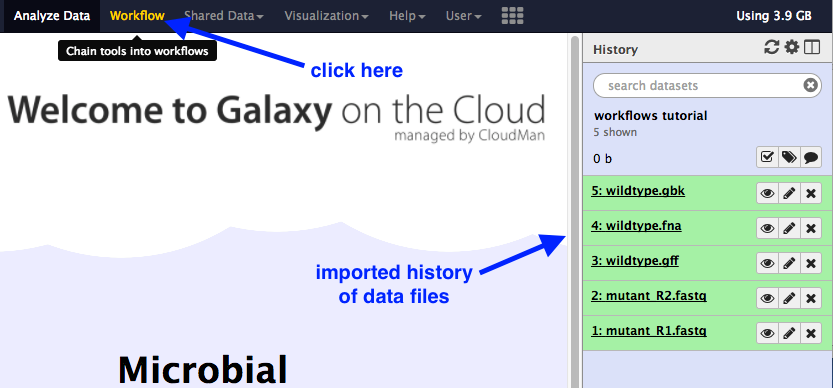
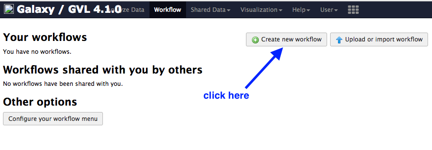
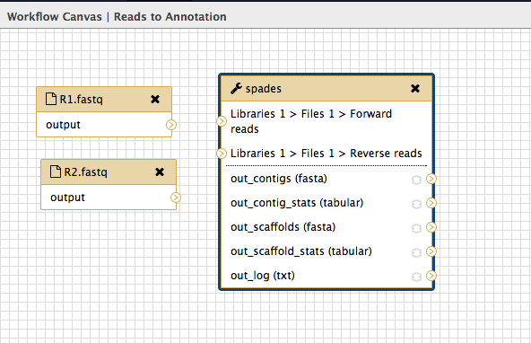
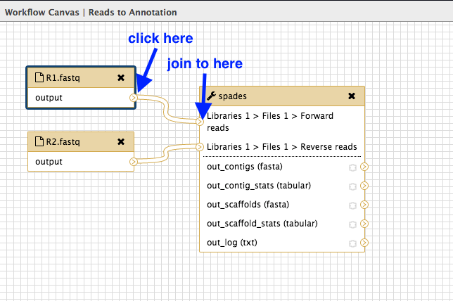
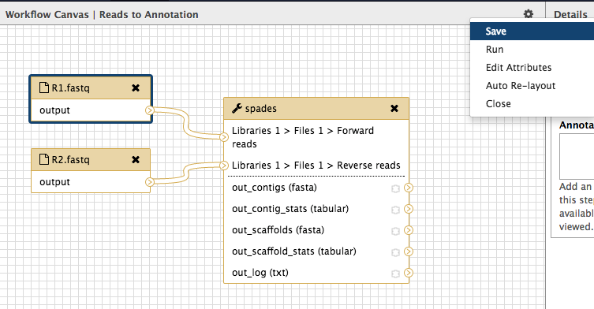
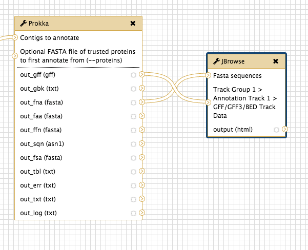
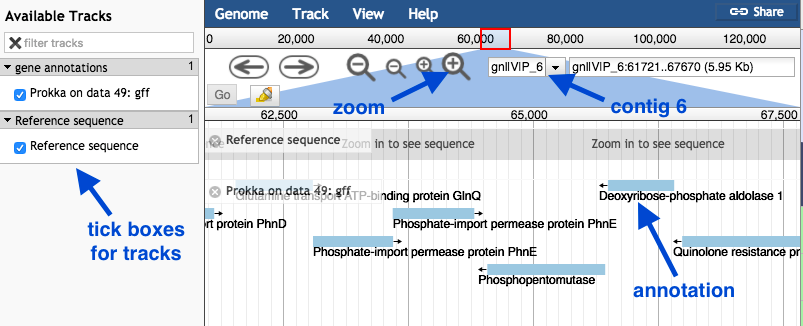
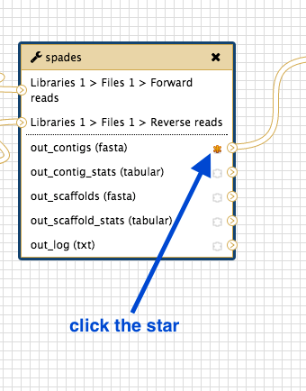

# Galaxy workflows

This tutorial assumes you have used Galaxy before.

Although we can use tools in Galaxy to analyse data and create a history, there is also a way to create a workflow of files, tools, settings and outputs. You can then input different datasets and run the workflow.

This tutorial covers building a workflow to analyse a bacterial genome, from input Fastq sequencing reads to assembly, annotation, and visualization.

## Start

Go to your Galaxy instance and Register/Login.

Import a history of data files:

- Click on the <ss>History</ss> cog 
- Select <ss>Import from File</ss>
- In the box called <ss>Archived History URL</ss>, paste in this link address to the Galaxy history of input files:

<tt>https://swift.rc.nectar.org.au:8888/v1/AUTH_377/public/Microbial_tutorials/Galaxy_history_input_files.tar.gz</tt>

- Click <ss>Submit</ss>
- Wait a few seconds.
- Click on the "View all histories" button 
- See if the Galaxy history has been imported: it will be called <fn>imported from archive: Data</fn>
- Above that pane, click on the <ss>Switch to</ss> button.
- Then click <ss>Done</ss> (in the top left corner).
- You should now have a list of five files in your current history.

- Re-name this history "Workflows".

## Build a workflow

We will first write a workflow for genome assembly.

- In the top menu bar in Galaxy, click on "Workflow".

- Click on <ss>Create new workflow</ss>

- Under <ss>Workflow Name:</ss> put in "Reads to Annotation".

- Click <ss>Create</ss>

- This will bring up the "Workflow Canvas", a grid where you can arrange the workflow.

### Add inputs

- In the Tools panel, click <ss>Inputs: Input datset</ss> twice (at the very top of the list).

- A box will appear: drag it to the left and there will be another box underneath it. Drag this also to the left. Your workflow canvas should look like this:

- Click on the first box. Look in the right hand panel (now called "Details") and change the name of the Input dataset to <fn>R1.fastq</fn>. Press Enter for the change to be saved.

- Repeat for the second input dataset box, naming that one <fn>R2.fastq</fn>.

### Add the tool "spades"

- In the tools panel, click on <ss>NGS Analysis: NGS Assembly: spades</ss>.
This puts the spades box onto the workflow canvas.

- Click on the spades box and look in the Details pane on the right. This shows all the options in spades. Choose:

- <ss>Run only Assembly</ss>: *Yes* [the *Yes* button should be darker grey]
- <ss>Kmers to use separated by commas:</ss> *33,55,91*  [note: no spaces]  
- <ss>Coverage cutoff:</ss> *auto*  

### Join inputs to the tool

Now tell spades which input files to use.

- Look at the input dataset box called <fn>R1.fastq</fn> and find the small arrow: >

- Click on this and drag the arrow over to the spades box input arrow > next to "Libraries 1 > Files 1 > Forward reads".

- Repeat for the dataset box <fn>R2.fastq</fn>, joining to the spades box next to "Libraries 1 > Files 1 > Reverse reads".

### Save it and run

- Click on the cog at the top right of the workflow canvas and "Save".

- Click the cog again and choose "Run".

- This brings up a window where you specify the input datasets to use in the workflow.

    - Under <ss>Step1: Input dataset</ss> choose <fn>mutant_R1.fastq</fn>.
    - Under <ss>Step2: Input dataset</ss> choose <fn>mutant_R2.fastq</fn>.

- Click <ss>Run workflow</ss>.

This will run the workflow (spades) and save the output to the top of your current history in the right hand panel.

- View some of the output files with the eye icon to check that the workflow (in this case, just spades) ran correctly.

## Add to the worfklow

We will add another tool to the workflow.

- Go to the top Galaxy panel and click "Workflow".

- Your workflow <fn>Reads to Annotation</fn> should be in the list. Click on the drop-down arrow next to this workflow and choose <ss>Edit</ss>.

- This will bring up the Workflow Canvas where we can add more inputs and tools.

- In the Tools panel, click on <ss>NGS Annotation: Prokka</ss>. This will add a Prokka box to the workflow canvas.

- We need to tell Prokka which genome assembly) to annotate. Join the spades output called <fn>out_contigs(fasta)</fn> to the Prokka input called <fn>Contigs to annotate</fn>.

- Click on the Prokka box and change some of the settings in the right hand Details panel:

    - Set the following parameters (leave everything else unchanged):
    - <ss>Locus tag prefix (--locustag)</ss>: P
    - <ss>Force GenBank/ENA/DDJB compliance (--compliant)</ss>: *No*
    - <ss>Sequencing Centre ID (--centre)</ss>: V
    - <ss>Use genus-specific BLAST database</ss> *No*  

- Click on the cog to the top right of the workflow canvas to save.

- Click on the cog again to run.

    - Again, choose the input files: <fn>mutant_R1.fastq</fn> and <fn>mutant_R2.fastq</fn>, and then click <ss>Run workflow</ss>.

- The output from the workflow (files from spades and prokka) will appear at the top of the History panel.

- Click on the eye icon for some files to verify the workflow ran correctly.      

## Add more to the workflow

We will add a visualization tool to view the genome annotation.

- Go to the top Galaxy panel and click "Workflow".

- Your workflow <fn>Reads to Annotation</fn> should be in the list. Click on the drop-down arrow next to this workflow and choose <ss>Edit</ss>.

- This will bring up the Workflow Canvas where we can add more inputs and tools.

- In the Tools panel, click on <ss>Statistics and Visualisation: Graph/Display Data: JBrowse</ss>. This will add a JBrowse box to the workflow canvas.

- Click on the JBrowse box. In the Details pane:

    - Under <ss>JBrowse-in-Galaxy Action</ss> choose *New JBrowse Instance*.

    - Under <ss>Reference genome to display</ss> choose *Use a genome from history*.

    - For <ss>Produce a Standalone Instance</ss> select *Yes*.

    - For <ss>Genetic Code</ss> choose *11: The Bacterial, Archaeal and Plant Plastid Code*.

    - Click <ss>Insert Track Group</ss>

    - Under <ss>Track Category</ss> type in *gene annotations*.

    - Click <ss>Insert Annotation Track</ss>

    - For <ss>Track Type</ss> choose *GFF/GFF3/BED/GBK Features*

    - Under <ss>JBrowse Track Type[Advanced]</ss> select *Canvas Features*.

    - Click on <ss>JBrowse Styling Options <Advanced]</ss>

    - Under <ss>JBrowse style.label</ss> correct the word "prodcut" to "product".

    - Under <ss>Track Visibility</ss> choose *On for new users*.

- Now we need to tell JBrowse the input files to use.

    - Join the Prokka output <fn>out_fna (fasta)</fn> to the JBrowse input <fn>Fasta sequences</fn>

    - Join the Prokka output <fn>out_gff (gff)</fn> to the JBrowse input <fn>Track Group 1...</fn>

- Click on the cog to save; again to run; choose input files; <ss>Run workflow</ss>; examine output files in current history.

- The workflow will now assemble and annotate the genome, and create a JBrowse view of the annotations.

- JBrowse will produce one output file.

    - Click on the eye icon to view.
    - In the centre drop down box, choose contig 6.
    - Under "Available Tracks" on the left, tick the boxes.
    - Zoom in and out with the plus and minus icons.
    - The blue blocks are the genome annotations.

<!--  ## Extension section

Create a new workflow for variant calling.
- inputs:
- tools:
- jbrowse:

-->

## Summary

- Our workflow is now:

    - <fn>Fastq</fn> sequence reads to Spades for assembly
    - Spades <fn>contigs fasta file</fn> to Prokka for annotation
    - Prokka <fn>fasta file</fn> and <fn>.gff file</fn> to JBrowse for visualisation.

- We can re-run this workflow with different input Fastq files.

## Other workflow options

### Saving outputs

To save only some output files:

- Go to the workflow canvas.
- Find the star next to the outputs.
- Click on the star for any outputs you want to save.

To save these starred files from the workflow output as a new history:

- Before you click <ss>Run workflow</ss>, tick the box above to <ss>Send results to a new history</ss>.

###Import a workflow

To import an existing Galaxy Workflow:

- Go to the Workflow tab in the top panel.
- At the top right, click on <ss>Upload or import workflow</ss>.

###Extract a workflow

You can extract a workflow from an existing Galaxy history.

- Go to your Galaxy history
- Click on the History cog icon and choose "Extract Workflow".
- Give it a name and click <ss>Create Workflow</ss>.
- To edit, go to the Workflow tab, select the workflow, and choose "Edit" from the drop down menu. You can then edit the steps on the Workflow Canvas.

### A note on workflow tabs

We have been using the top Workflow tab. There is another tab at the bottom of the tool panel called Workflows. Click on <ss>Workflows: All Workflows</ss>. This gives a similar view with a list of workflows, and you can also click on the top right tab "switch to workflow management view".

To return to the main Galaxy window click on the Analyze Data tab in the top panel.

### Links

Introduction to workflows:
<https://wiki.galaxyproject.org/Learn/AdvancedWorkflow>

Another tutorial on workflows:
<http://vlsci.github.io/lscc_docs/tutorials/galaxy-workflows/galaxy-workflows/>

Galaxy published workflows:
<https://usegalaxy.org/workflow/list_published>
